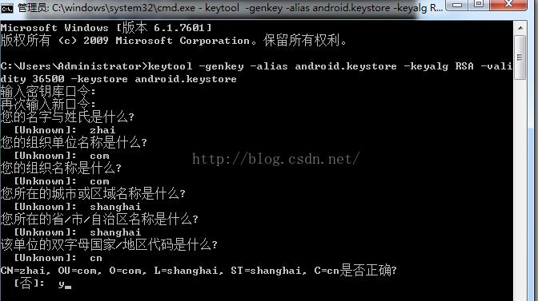
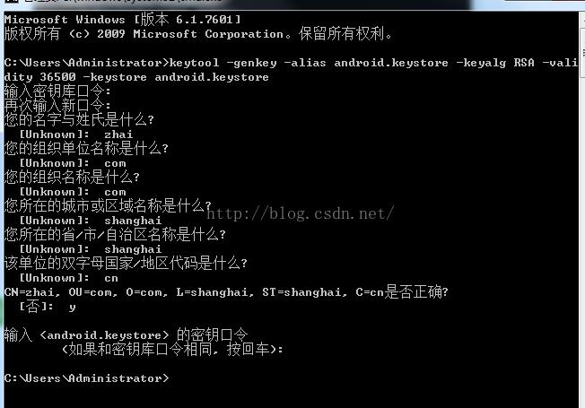
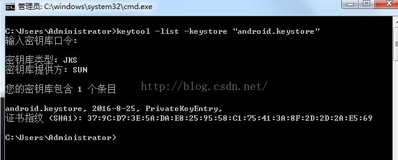

## Android证书申请

### 打包前的准备

#### 关于JDK 安装，以及Java环境的设置

```
下载JDK1.6，选择对应的安装路径
配置相应的Java 
A、属性名称：JAVA_HOME   属性值：C:\Program Files\Java\jdk1.6.0_02
B、属性名称：PATH   属性值：;%JAVA_HOME%\bin;%JAVA_HOME%\jre\bin
C、属性名称：CLASSPATH   属性值：.;%JAVA_HOME%\lib\dt.jar;%JAVA_HOME%\lib\tools.jar
(注意要加.表示当前路径，另外，%JAVA_HOME%就是引用前面指定的JAVA_HOME)
```
<font color=red size=3>关于环境变量是否安装成功的测试</font>


> “开始”－>;“运行”，键入“cmd”；
> 键入命令命令，出现画面，说明环境变量配置成功：
>         A、java -version；
>         B、java；
>         C、javac；

#### Android SDK的安装与环境变量配置

<font color=red size=3>注意：配置Andriod环境变量前提是要先安装好JAVA环境</font>

```
下载Android SDK，点击安装，直接默认路径即可！ 下载地址：http://developer.android.com/sdk/index.html
默认路径安装后，安装完成，开始配置环境变量。
打开计算机属性——高级系统设置——环境变量（如上文）
新建一个系统环境变量，变量名：ANDROID_HOME，变量值：D:\adt-bundle-windows-x86_64-20140702\sdk（以你安装目录为准,确认里面有tools和add-ons等多个文件夹），点击确认。
在用户变量PATH后面加上变量值;%ANDROID_HOME%\platform-tools;点击确认即可。 在系统变量path中添加;D:\adt-bundle-windows-x86_64-20140702\sdk\tools
Android SDK配置完成，接下来验证配置是否成功。
点击运行——输入cmd——回车——输入adb——回车，如果出现一堆英文，显示成功，即表示配置成功，在输入Android，启动Android SDK Manager。
```

### 新建一个数字证书，即keystore文件
#### 简介

> 正式打包发布Android的apk应用，需要先选择或新建一个数字证书，即keystore文件，生成数字证书的常用方法有两：一是利用eclipse生成，二是在命令行中生成，下面我们来介绍如何在命令行中生成Android的数字证书。

#### 首选需要安装jdk环境（这里默认已安装）
> 因为Android的数字证书keystore文件的生成是用了Java的数据证书管理工具Keytool。
> 确保配置好Java的环境后，使用Windows快捷键Win+R，调出“命令提示符”窗口，在窗口中输入cmd，打开命令行输入如下命令
`    
keytool -genkey -alias android.keystore -keyalg RSA -validity 36500 -keystore android.keystore
`   
> （这句话的意思是：创建了一个名为android.keystore的别名也为android.keystore的采用RSA加密算法的有效期为100年的证书文件）
   注：
>    -genkey 生成文件。
>    -alias 别名。
>    -keyalg 加密算法。
>    -validity 有效期。
>    -keystore 文件名。
>   然后填写依次填写密钥库口令、确认口令、姓名与姓氏、组织单位、城市或区域、省/市/自治区、国家/地区代码，最后如果正确的话填“y”，如果错误的话直接“Enter”下去，重新 再填，如下图


> 注意：密钥库口令一定要记住，以后还会用到。
> 当输入"y"后没有回提示输入“输入<android.keystore>的密钥口令”，如果跟密钥库口令一样就按回车键，否则输入，然后再确认，就生成了数字证书，如下图所示


>   运行结束会在C:\Users\Administrator目录下看到一个android.keystore文件
>   在命令行中输入keytool -list -keystore "android.keystore"命令，然后输入命令就可以看到证书的相关信息，如下图所示。

