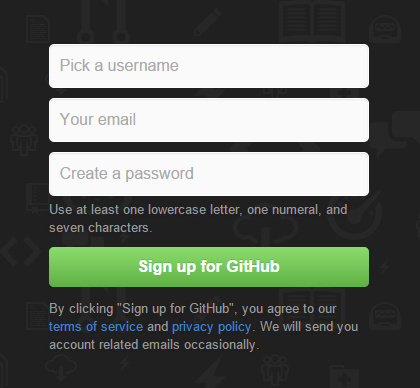
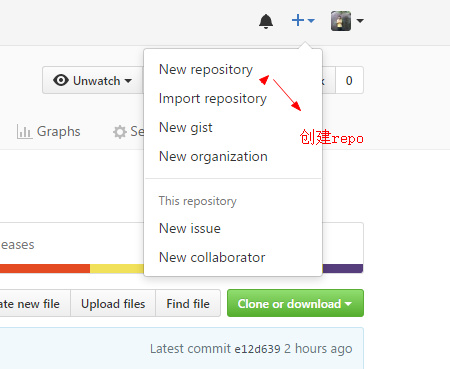
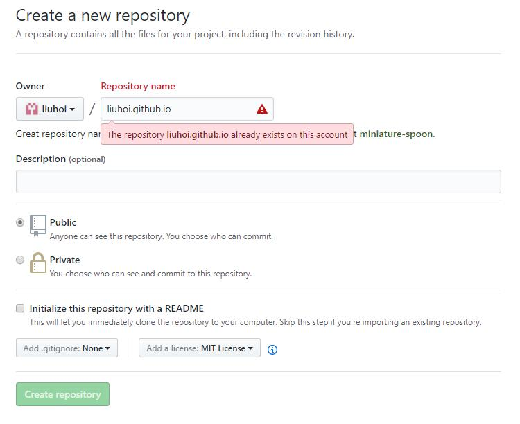
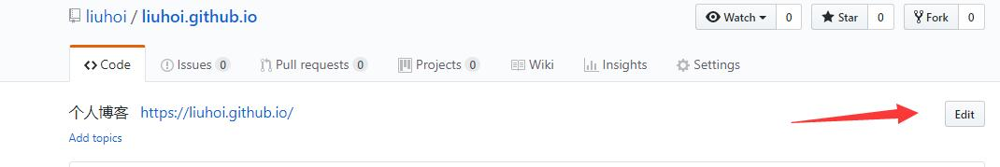
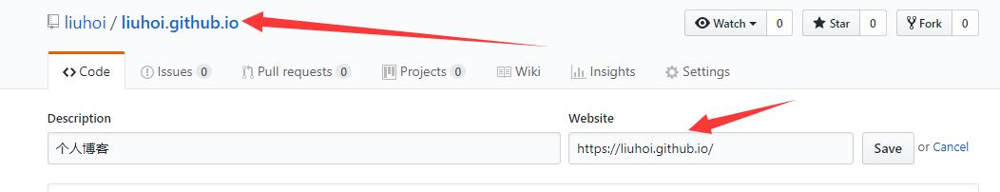
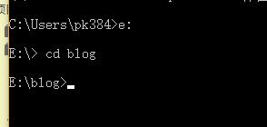
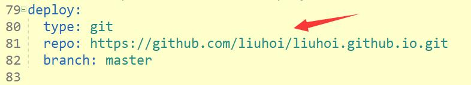
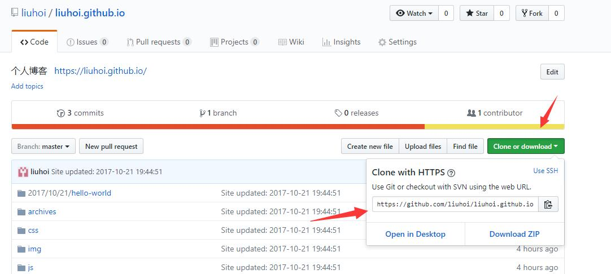
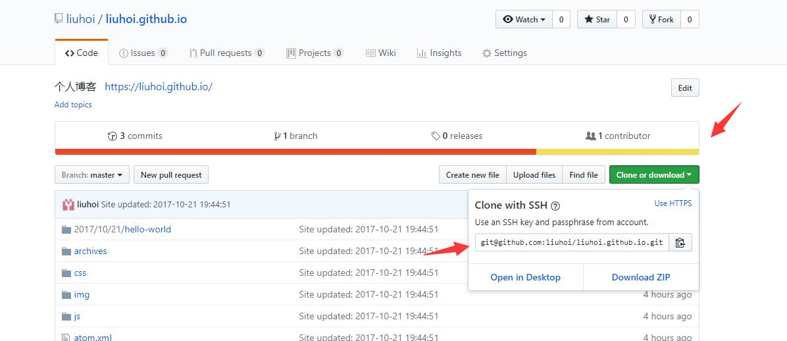

## nodeJs准备 [下载地址](http://nodejs.cn/)

```
查询node版本：	node -v
查询npm版本：	npm -v
```
## github账户准备

第一步: Github注册
打开 [注册地址](https://github.com/join?source=header-home)，在下图的框中，分别输入自己的用户名，邮箱，密码。


第二步: 创建代码库
登陆之后，点击页面右上角的加号，选择New repository：

进入代码库创建页面：
在Repository name下填写yourname.github.io，Description (optional)下填写一些简单的描述（不写也没有关系），如图所示：

注意：比如我的github名称是liuhoi ,这里你就填 liuhoi.github.io,如果你的名字是xiaoming，那你就填 xiaoming.github.io

第三步: Website设置 如下图所示



 如果你的配置没有问题，那么大约15分钟之后，yourname.github.io这个网址就可以正常访问了~ 如果yourname.github.io已经可以正常访问了，那么Github一侧的配置已经全部结束了。


## hexo 安装
在自己认为合适的地方创建一个文件夹，这里我以E：/blog 为例子讲解，首先在E盘目录下创建blog文件夹，并在命令行的窗口进入到该目录

进入之后 执行下面的命令
```
查询版本   hexo -version
npm install hexo-cli -g
hexo init blog
cd blog
npm install
npm install hexo-deployer-git --save
npm install hexo-renderer-less --save(预处理Less文件，如不使用indigo主题，则不执行此命令)
npm install hexo-generator-feed --save(用于生成 rss，如不使用indigo主题，则不执行此命令)
npm install hexo-generator-json-content --save(用于生成静态站点数据，用作站内搜索的数据源，如不使用indigo主题，则不执行此命令)
nnpm install hexo-helper-qrcode --save(用于生成微信分享二维码，如不使用indigo主题，则不执行此命令)
npm install hexo-asset-image --save
hexo generate
hexo server
在浏览器中打开http://localhost:4000，你将会看到效果
```
注意：hexo用本地图片步骤
```
把主页配置文件_config.yml 里的post_asset_folder:这个选项设置为true
在你的E：/blog/blog目录下执行这样一句话npm install hexo-asset-image --save，这是下载安装一个可以上传本地图片的插件
运行hexo new "xxxx"来生成md博文时，/source/_posts文件夹内除了xxxx.md文件还有一个同名的文件夹最后在xxxx.md中想引入图片时，先把图片复制到xxxx这个文件夹中，然后只需要在xxxx.md中按照markdown的格式引入图片：注意： xxxx是这个md文件的名字，也是同名文件夹的名字。只需要有文件夹名字即可，不需要有什么绝对路径。你想引入的图片就只需要放入xxxx这个文件夹内就好了，很像引用相对路径。
最后检查一下，hexo g生成页面后，进入public\2017\02\26\index.html文件中查看相关字段，可以发现，html标签内的语句是，而不是。这很重要，关乎你的网页是否可以真正加载你想插入的图片。
```

## git [下载地址](https://github.com/waylau/git-for-win)
`
查询版本   git --version
`
`
git config --system --list
`
`
git config --global  --list
`
`
git config --local  --list
`

### 配置Git个人信息（使用gitCMD并且进入E：/blog/blog目录）
1、设置Git的user name和email：(如果是第一次的话)
```
git config --global user.name "liuhui"
git config --global user.email "pk3845473@163.com"
```
2、生成密钥
`
 ssh-keygen -t rsa -C "pk3845473@163.com"
` 
### 配置deploy
同样在config.yml文件中，找到deploy，然后按照如下修改：

图中红色箭头地址查看如下图：





配置好之后可以生成新文章：

`
生成新文章命令     hexo new post "article title"(只能为英文  否者在github中不能生成)
`
这时候在我的 电脑的目录下 E：\blog\blog\source\ _posts 将会看到 article title.md 文件
用MarDown编辑器打开就可以编辑文章了。文章编辑好之后，运行生成、部署命令：
```
部署到github之前执行命令      hexo clean 
部署到github命令      hexo deploy   
```

## hexo 配置

### hexo _config.yml配置

```
# Hexo Configuration
## Docs: https://hexo.io/docs/configuration.html
## Source: https://github.com/hexojs/hexo/

# Site  ##页面信息
title: 刘辉的博客   ##标题，即浏览器标签栏显示的内容
subtitle: 付出努力才会得到回报   ##副标题
description: 刘辉的博客   ##描述，简介
author: 刘辉     ##作者
language: zh-CN   ##语言
timezone:   ##时区

# URL
## If your site is put in a subdirectory, set url as 'http://yoursite.com/child' and root as '/child/'
url: https://liuhoi.github.io/    ##默认点击后URL地址
root: /
permalink: :year/:month/:day/:title/
permalink_defaults:

# Directory    ##文件目录，可不改
source_dir: source
public_dir: public
tag_dir: tags
archive_dir: archives
category_dir: categories
code_dir: downloads/code
i18n_dir: :lang
skip_render:

# Writing    ##静态页面生成属性，可不改
new_post_name: :title.md # File name of new posts
default_layout: post
titlecase: false # Transform title into titlecase
external_link: true # Open external links in new tab
filename_case: 0
render_drafts: false
post_asset_folder: true
relative_link: false
future: true
highlight:
  enable: true
  line_number: true
  auto_detect: false
  tab_replace:
  
# Home page setting
# path: Root path for your blogs index page. (default = '')
# per_page: Posts displayed per page. (0 = disable pagination)
# order_by: Posts order. (Order by date descending by default)
index_generator:
  path: ''
  per_page: 10
  order_by: -date
  
# Category & Tag   ##标签，可不改
default_category: uncategorized
category_map:
tag_map:

# Date / Time format    ##时间格式，可不改
## Hexo uses Moment.js to parse and display date
## You can customize the date format as defined in
## http://momentjs.com/docs/#/displaying/format/
date_format: YYYY-MM-DD
time_format: HH:mm:ss

# Pagination  ##每页显示文章数，按需改
## Set per_page to 0 to disable pagination
per_page: 10
pagination_dir: page

# Extensions  ##主题设置
## Plugins: https://hexo.io/plugins/
## Themes: https://hexo.io/themes/
theme: indigo   ##主题设置（themes里面）

# Deployment  ##git部署关联
## Docs: https://hexo.io/docs/deployment.html
deploy:
  type: git
  repo: https://github.com/liuhoi/liuhoi.github.io.git
  branch: master
```
### 主题    _config.yml配置

以我现在使用的indigo主题为例。首先将主题库clone到blog目录下的themes目录：
`
 git clone git@github.com:yscoder/hexo-theme-indigo.git themes/indigo
`
indigo主题   _config.yml配置

```
# hexo-theme-indigo
# https://github.com/yscoder/hexo-theme-indigo

# 添加新菜单项遵循以下规则
# menu:
#  link:               fontawesome图标，省略前缀，本主题前缀为 icon-，必须
#    text: About       菜单显示的文字，如果省略即默认与图标一致，首字母会转大写
#    url: /about       链接，绝对或相对路径，必须。
#    target: _blank    是否跳出，省略则在当前页面打开
menu:
  home:
    text: 主页
    url: /
  archives:
    text: 归档
    url: /archives
  tags:
    text: 标签
    url: /tags
  th-list:
    text: 分类
    url: /categories
  github:
    url: https://liuhoi.github.io/
    target: _blank
  #weibo:
    #url: http://www.weibo.com/ysweb
   #target: _blank
  #link:
    #text: 测试
    #url: /about
rss: /atom.xml
# 你的头像url
avatar: /img/cat1.JPG
# avatar link
avatar_link: /
# 头像背景图
brand: /img/brand.jpg
# favicon
favicon: /img/cat1.JPG

# email
email: pk3845473@163.com

# 设置 Android L Chrome 浏览器状态栏颜色
color: '#3F51B5'

# 页面标题
tags_title: 标签
archives_title: 归档
categories_title: 分类

# 文章截断
excerpt_render: false
excerpt_length: 200
excerpt_link: 阅读全文...
mathjax: false
archive_yearly: true

# 是否显示文章最后更新时间
show_last_updated: true

# 是否开启分享
share: true

# 是否开启打赏，关闭 reward: false
reward:
  title: 谢谢大爷~
  wechat: /img/wechat.JPG     #微信，关闭设为 false
  alipay: /img/alipay.JPG     #支付宝，关闭设为 false

# 是否开启搜索
search: true

# 是否大屏幕下文章页隐藏导航
hideMenu: true

# 是否开启toc
# toc: false
toc:
  list_number: true  # 是否显示数字排序

# 文章页留言内容，hexo中所有变量及辅助函数等均可调用，具体请查阅 hexo.io
postMessage: 这里可以写作者留言，标签和 hexo 中所有变量及辅助函数等均可调用，示例：<a href="<%- url_for(page.path).replace(/index\.html$/, '') %>" target="_blank" rel="external"><%- page.permalink.replace(/index\.html$/, '') %></a>

# 站长统计，如要开启，输入CNZZ站点id，如 cnzz: 1255152447
cnzz: false

# 百度统计，如要开启，改为你的 key
baidu_tongji: false

# 腾讯分析，如要开启，输入站点id
tajs: false

# google
google_analytics: false
google_site_verification: false

# less
less:
  compress: true
  paths:
    - source/css/style.less

# 以下评论插件开启一个即可
# 是否开启 disqus
disqus_shortname: false
# 是否开启友言评论, 填写友言用户id
uyan_uid: false
# 是否使用 gitment，https://github.com/imsun/gitment
gitment: false
# gitment:
#   owner:
#   repo:
#   client_id:
#   client_secret:

# 规范网址
# 让搜索引擎重定向你的不同域名、不同子域、同域不同目录的站点到你期望的路径
# https://support.google.com/webmasters/answer/139066
# 假设配置为 canonical: http://imys.net，那么从搜索引擎中 www.imys.net 进入会重定向到 imys.net
canonical: false

# 版权起始年份
since_year: 2017

# 用户页面中作者相关的描述性文字，如不需要设为 false
about: 用户页面中作者相关的描述性文字，如不需要设为 false

# “不蒜子”访问量统计，详见 http://ibruce.info/2015/04/04/busuanzi/
visit_counter:
  site_uv: 站点总访客数：
  site_pv: 站点总访问量：

# 动态定义title
title_change:
  normal: 刘辉的博客!
  leave: 付出努力才会得到回报！

# 设置为 true 发布后将使用 unpkg cdn
cdn: true

# 设置为 true 将使用 lightbox render 图片
lightbox: true

# icp备案号  ICP_license: 京ICP备1234556号-1
ICP_license: false

```
最后生成部署，来看看效果吧
```
hexo clean
hexo d 
```