## 证书申请第一部分：成员介绍

### 1.Certification(证书)

> 证书是对电脑开发资格的认证，每个开发者帐号有一套，分为两种：
> 1. Developer Certification(开发证书)
> 安装在电脑上提供权限：开发人员通过设备进行真机测试。
> 可以生成副本供多台电脑安装；
> 2. Distribution Certification(发布证书)
> 安装在电脑上提供发布iOS程序的权限：开发人员可以制做测试版和发布版的程序。不可生成副本，仅有配置该证书的电脑才可使用；

### 2.Provisioning Profile(授权文件)

> 授权文件是对设备如iPod Touch、iPad、iPhone的授权，文件内记录的是设备的UDID和程序的App Id，即：使被授权的设备可以安装或调试Bundle identifier与授权文件中记录的App Id对应的程序。
> 开发者帐号在创建授权文件时候会选择App Id，（开发者帐号下App Id中添加，单选）和UDID（开发者帐号下Devices中添加最多100个，多选）。
> 授权文件分为两种，对应相应的证书使用：
> 1. Developer Provisioning Profile(开发授权文件)
> 在装有开发证书或副本的电脑上使用，开发人员选择该授权文件通过电脑将程序安装到授权文件记录的设备中，即可进行真机测试。
> 注意：确保电脑有权限真机调试，即安装了开发证书或副本；在开发工具中程序的Bundle identifier和选中使用的授权文件的App Id要一致；连接调试的设备的UDID在选中的授权文件中有记录。
> 2. Distribution Provisioning Profile(发布授权文件)
> 在装有发布证书的电脑上（即配置证书的电脑，只有一台）制做测试版和发布版的程序。
> 发布版就是发布到App Store上的程序文件，开发者帐号创建授权文件时选择store选项，选择App Id，无需选择UDID；
> 测试版就是在发布之前交给测试人员可同步到设备上的程序文件，开发者帐号创建授权文件时选择AdHoc，选择App Id和UDID；只有选中的UDID对应的设备才可能安装上通过该授权文件制做的程序。

### 3. Keychain(开发密钥)

> 安装证书成功的情况下证书下都会生成Keychain，上面提到的证书副本（导出证书重新命名）就是通过配置证书的电脑导出Keychain（就是.p12文件）安装到其他机子上，让其他机子得到证书对应的权限。Developer Certification就可以制做副本Keychain分发到其他电脑上安装，使其可以进行真机测试。
> 注意：Distribution Certification只有配置证书的电脑才可使用，因此即使导出导出Keychain安装到其他电脑上，其他电脑也不可能具有证书的权限。

## 证书申请第二部分：证书申请流程

### step1:登录（99美元账号）https://developer.apple.com 

 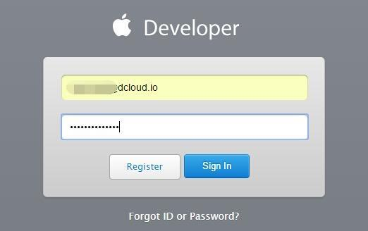

1. 登录成功后在页面右侧选择“Certificates”：

 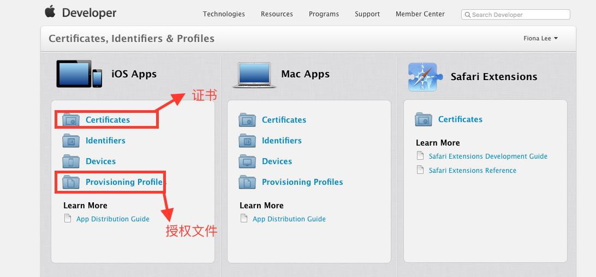
2. 打开之后可以看到面板：

 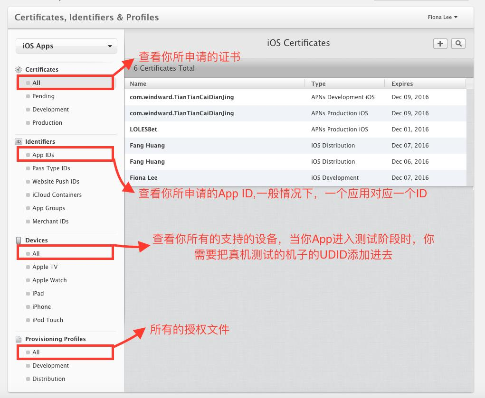

### step2:生成CSR文件

1. 打开 ->钥匙串访问

 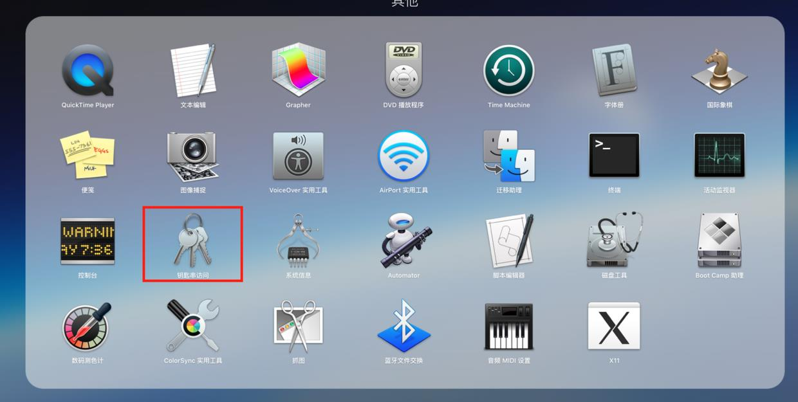
2. 打开右上方钥匙串访问栏->证书助理->从证书颁发机构请求证书…

  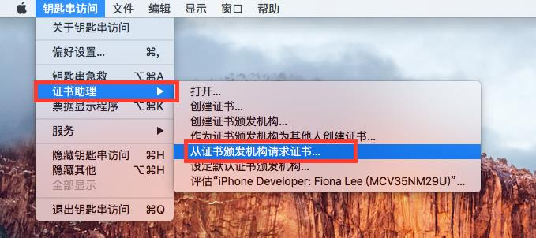
3. 填写一个邮箱地址，选择“存储到磁盘”，点击继续，完成了。

 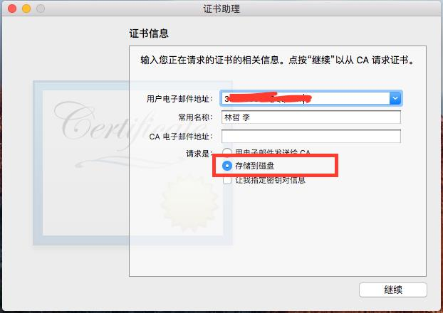 
 
申请成功后的文件：

  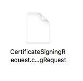 

### step3:注册 App ID 流程
1. 点c_3图面板中的App IDs 右上角的加号。然后填写App ID的名字：

 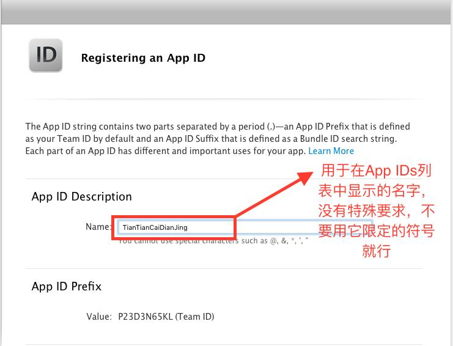 
2. 填写bundle ID:

  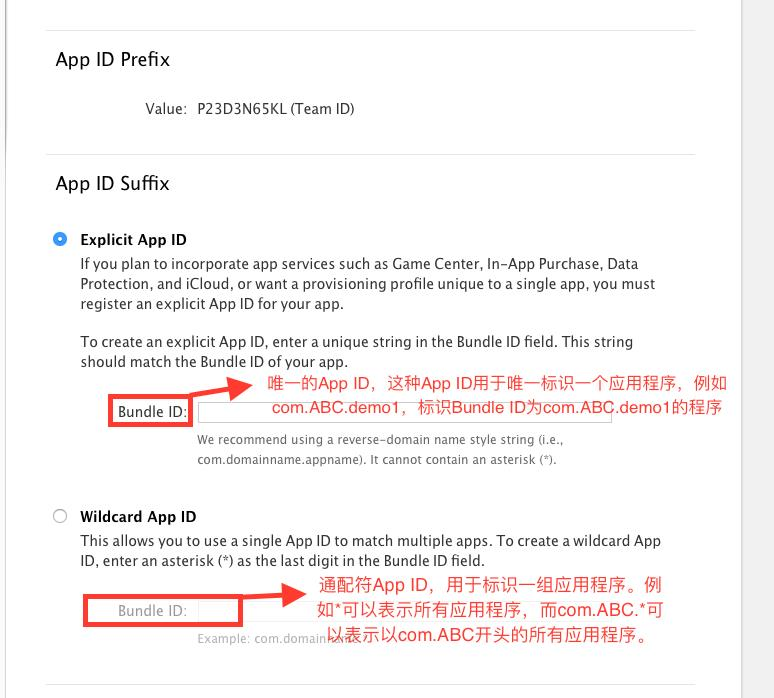 
3. 选择App需要支持的服务，（如：app耍要推送服务，就勾选Push Notifications)

 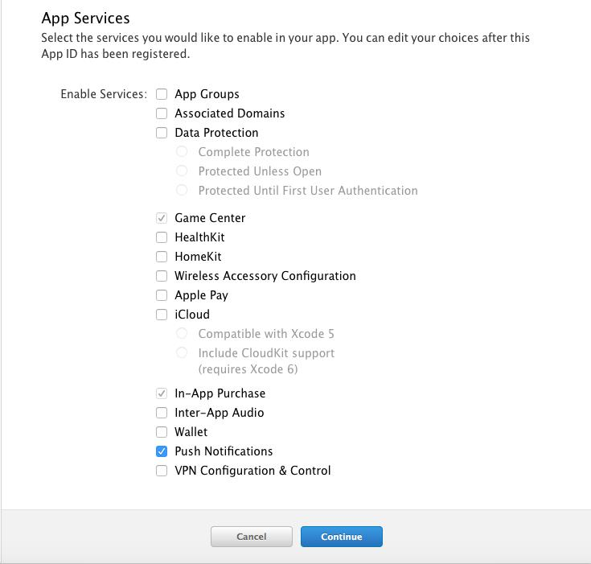 
4. 最后会有一个详细的内容列表，对应无误后，提交完成。

### step4: 证书申请

1. 选择证书的类型，下面罗列我们iOS开发常用的证书类型

  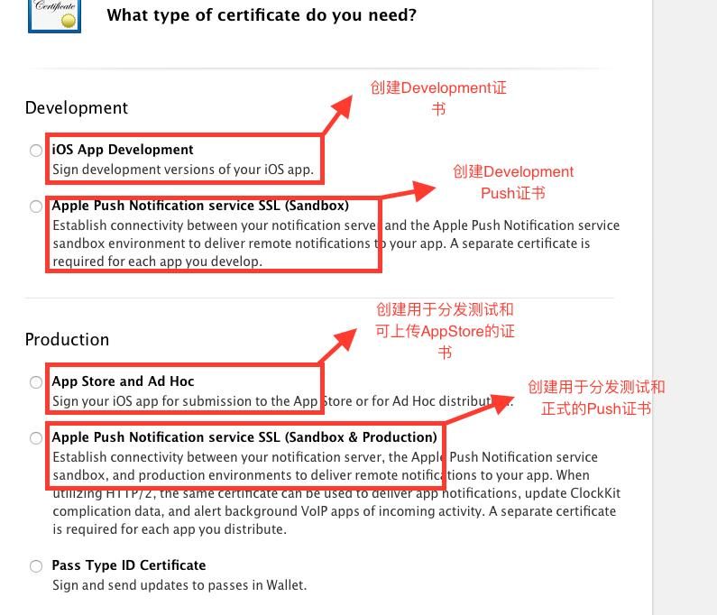 
2. 如果是申请推送证书，则会关联一个App ID

  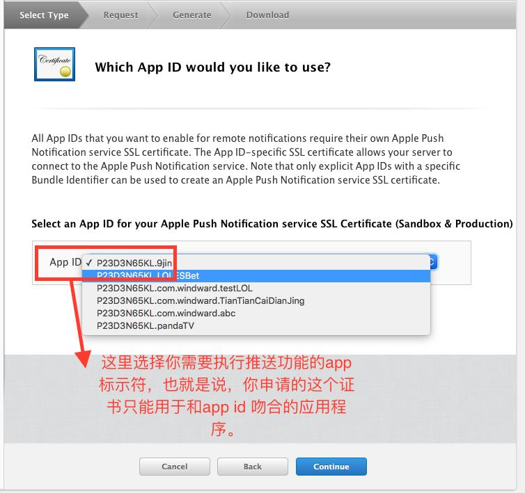 
3. 上传我们之前建好的CSR文件(详见step2)

 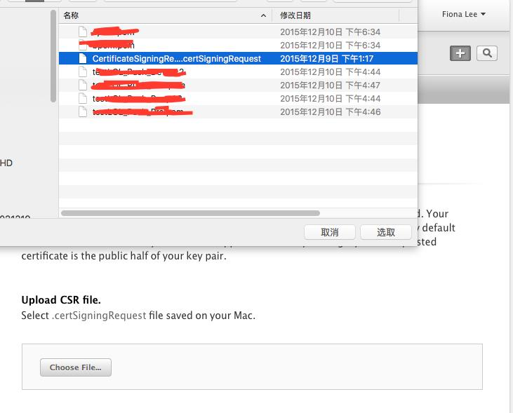  
4. 恭喜你，到此为止，你完成了证书的申请，简单吧。

### setp5:授权文件申请（Provisioning Profile）

1. 选择授权文件类型，下面罗列了iOS常的授权文件类型

  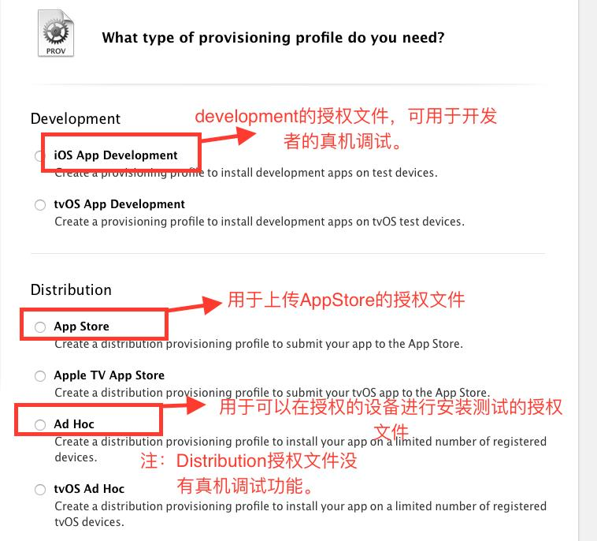   
2. 选择关联App ID

  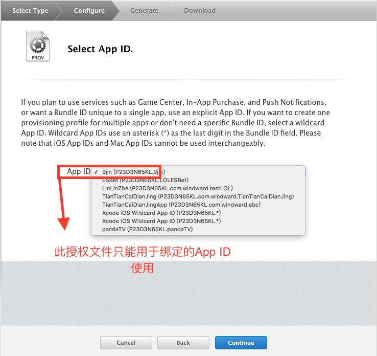   
3. 选择关联的证书

 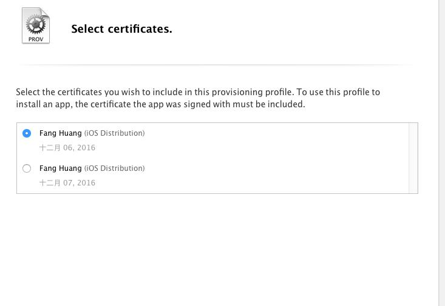   
4. 选择授权的设备（通过 UDID），除了企业证书（inHouse）外，只有你添加的设备才能进行调度或测试
 
 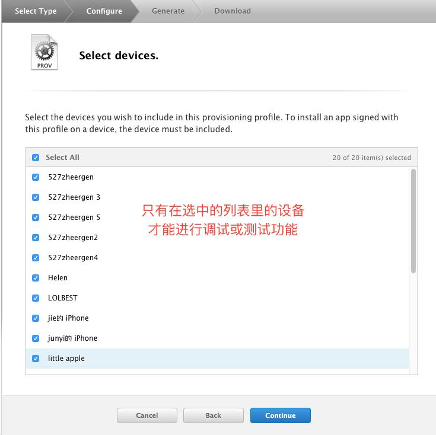   
5. 给授权文件命一个能和其它授权文件区分的名字

  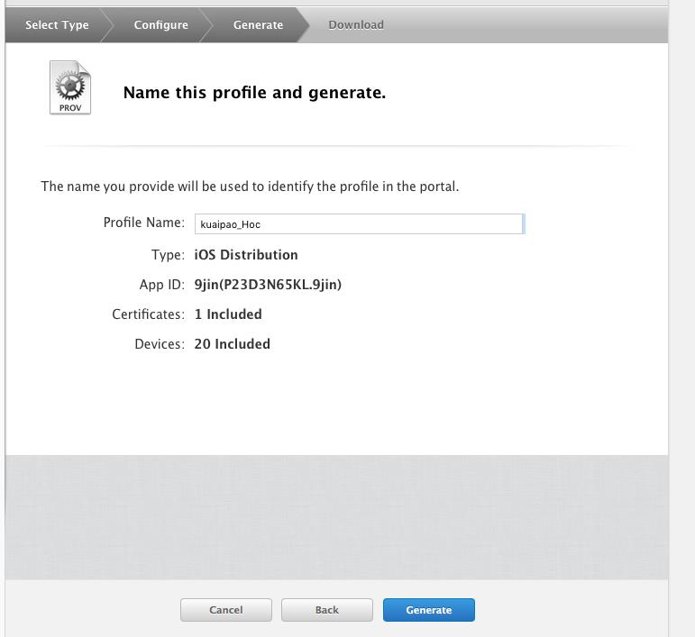  

> 恭喜你，到此为止，授权文件申请完成了，简单吧。
> 在我们iOS开发中，常用的证书相关操作流程就全在上面了。

## 证书申请第三部分:总结

1. 成功安装测试证书的条件：a).开发者证书+私钥。 b).授权文件。
2. 如果你想通过证书进行真机调试，请选择开发版证书(Development Certificate)，和相应的授权文件(Development Provisioning Profile) 。
3. 如果你想让更多的开发者能进行真机调试，请先对需要真机调试的设备进行授权，然后将开发版证书(Development Certificate)下载到本机安装后导出为带私的.p12的文件，和相应的授权文件(Development Provisioning Profile)交由开发者安装，成功后即可进行真机调试。
4. 如果你想让更多的机子进行真机测试，请先对需要测试的设备进行授权，然后选择生产版证书(Distribution Ad_hoc Certificate)和相应的授权文件(Distribution Ad_hoc Provisioning Profile)打包后分发给要测试的设备即可。

## IOS上架

### 1.HBuilder准备

1. 图标（需要一张1024*1024）
> APP显示用的图标  
2. 启动图片（安卓3张，ios13张）
   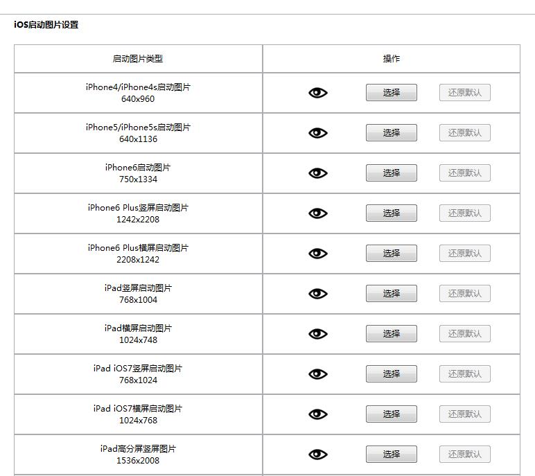  
   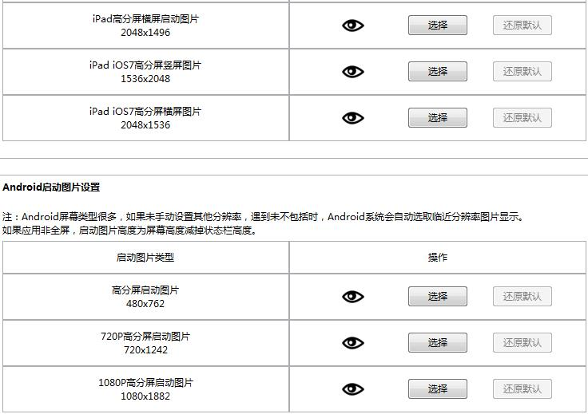  
   
### 2.HBuilder打包需要的文件

> AppID(Bundle ID)，私钥密码(生成p12证书时填写的密码)，
> Profile文件（描述文件也称授权文件以.mobileprovision结尾），
> 私钥证书（p12证书以.p12结尾）

   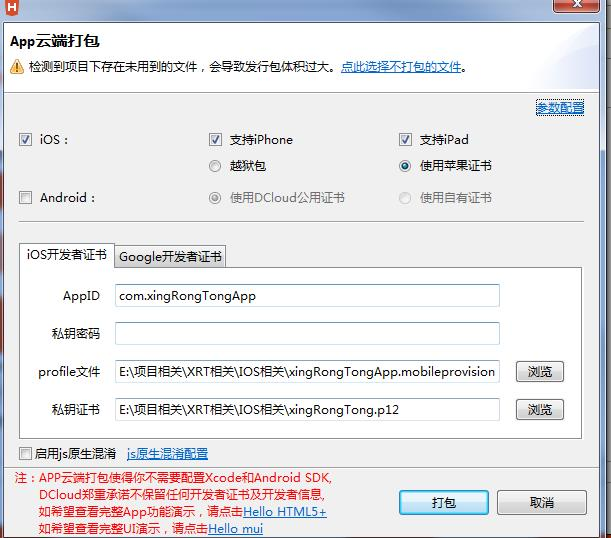  
 
### 3.Application Loader （苹果上传.ipa的软件）

1. 开发这账户
> 登陆账户
2. App专用密码
> 前往https://appleid.apple.com 申请  

 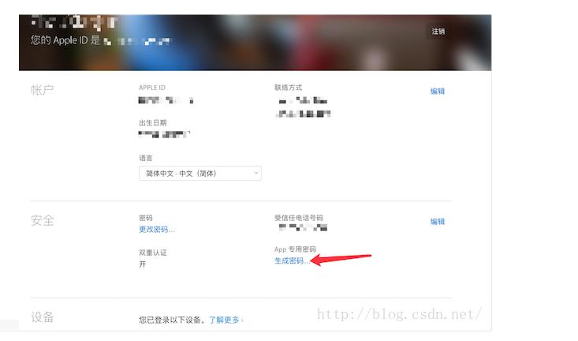 
 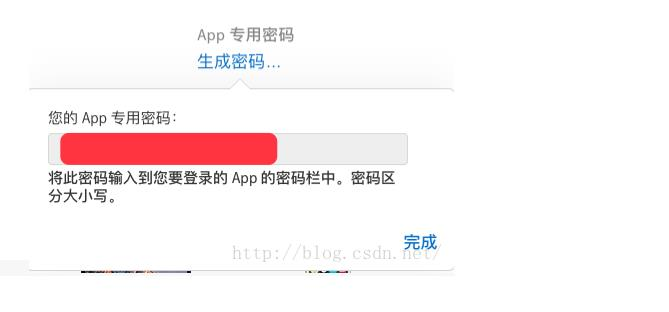   
 
### 3.iTunes connect准备(苹果的网站https://itunesconnect.apple.com/login)

1. 图标（需要一张1024*1024）
> APP显示用的图标  
2. APP宣传页(1-5张，分辨率需要如下)
    
    
3. 电话号码，邮箱，公司名称，技术支持网址(URL) 等
> 电话号码，邮箱等 电话号码要加+86如+8613888888888
> 技术支持网址(URL):pc端官网

