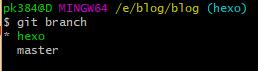

## 第一步：git branch 查看当前分支情况
`
git branch  //查看当前分支情况
`

我现在有2个分支  master和hexo

## 第二步：git branch 分支名，新建一个自己的分支

`
git branch 分支名  // 新建一个自己的分支
`

我已经创建了一个hexo分支，所以提示已存在

## 第三步：git checkout 分支名，切换到新建的分支
`
git checkout 分支名    //切换到新建的分支
`

## 第四步：git branch，重新查看一下

带星号表示当前分支

## 第五步：git push -u origin 分支名,同步到github线上
`
git push -u origin 分支名    //将新建分支同步到线上
`

## 第六步：进行add命令

执行命令git add --all,将修改保存到缓存区，如果想添加某一个文件，则将后面的--all换成你要提交的文件名即可。
`
git add --all
`

## 第七步：commit提交

将增加的文件commit到本地仓库里去，执行命令git commmit -m "注释语句"
``
git commit -m '注释语句'（引号内容可改）
`
## 第八步：git push -u origin 分支名,同步到github线上

将commit的代码push到远程分支
`
git push -u origin 分支名    //同步到线上新建分支
`

以后每次更新都执行这三步add,commit,push